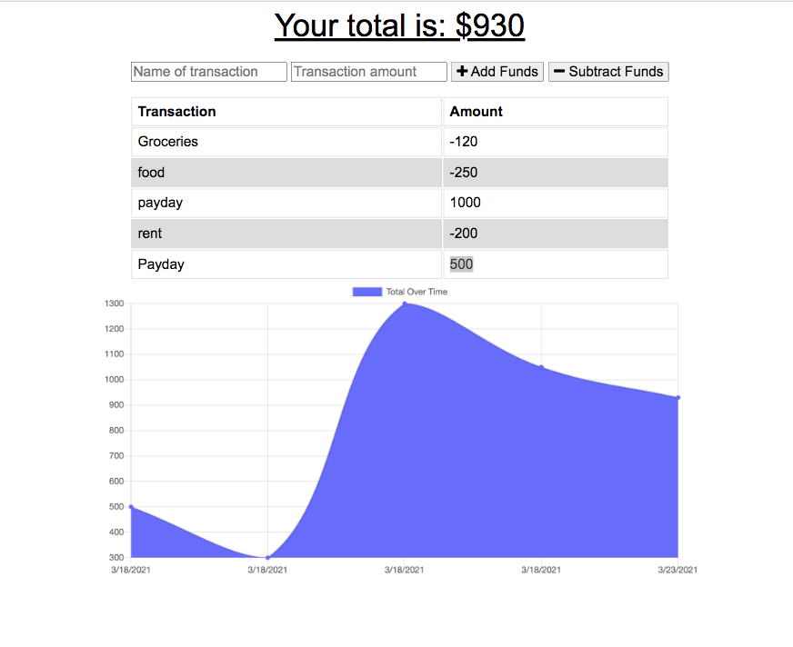

## Budget-Tracker-Online-Offline

A Budget Tracker application that gives users a fast and easy way to track their money anytime. 

---
| Table of Contents |
|---|
| [Description](#Description) |
| [Installation](#Installation) |
| [Usage](#Usage) |
| [License](#License) |
| [Contributing](#Contributing) |
| [Questions](#Questions) |
---

## Description

Users will be able to add expenses and deposits to their budget with or without a connection. Any changes made offline will populate automatically when user  is brought back online. 

Technologies utilised: PWA's, IndexedDB, Mongoose, Node,js. 

## Installation

Download the pacakge and run npm i in command line to install all dependencies. 

## Usage

Deployed application here: 

Application should appear as follows: 

 

## License 

## Contributing
To contribute please refer to https://github.com/microsoft/vscode/wiki/How-to-Contribute

## Questions
Please direct questions to the following email: karrynsaw@gmail.com

Github: https://github.com/KarrynS

